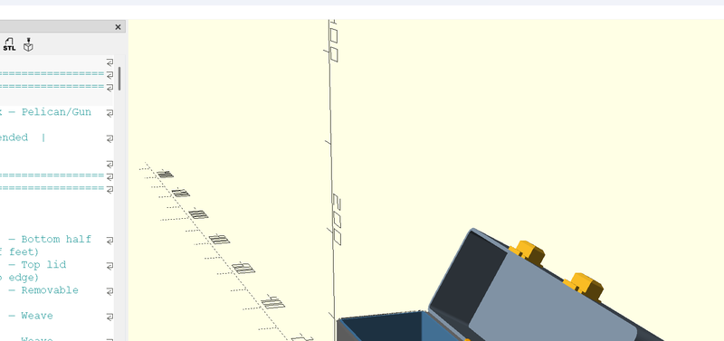

# Protective Storage Box — Pelican/Gun Case Style



A 3D-printable protective storage box designed in OpenSCAD. Features a clamshell design with barrel hinges, butterfly latches, removable compartmented tray, and snap-fit 3-piece construction for printers with beds smaller than 420mm.

## Specifications

| Parameter | Value |
|---|---|
| Outer Dimensions | 420 x 110 x 160 mm |
| Wall Thickness | 4 mm |
| Bottom Height | 100 mm |
| Lid Height | 60 mm |
| Corner Radius | 10 mm (3D filleted) |
| Material | PETG recommended |

## Features

- Clamshell opening with 2 barrel hinges (M3 pin)
- 2 butterfly clamp latches (gun-box style)
- Removable interior tray (40mm) with finger notches
- Tray support ledge inside box walls
- Basket-weave lid insert (multi-color: white + blue)
- Gasket groove for weatherproofing (1mm silicone cord)
- 6 standoff feet with rubber pad recesses
- Split parts for printers with <420mm bed (e.g. Creality K2 Plus)

## Project Structure

```
open-cad/
  README.md
  .gitignore
  cad/                          # OpenSCAD source files
    protective_storage_box.scad   # Main library (all modules)
    view_closed.scad              # Assembly view: closed
    view_open.scad                # Assembly view: lid open
    view_open_tray_out.scad       # Assembly view: lid open, tray lifted
    stl_bottom_left.scad          # Export: box bottom left half
    stl_bottom_right.scad         # Export: box bottom right half
    stl_lid_left.scad             # Export: lid left half
    stl_lid_right.scad            # Export: lid right half
    stl_tray_left.scad            # Export: tray left half
    stl_tray_right.scad           # Export: tray right half
    stl_weave_frame_left.scad     # Export: weave frame left half
    stl_weave_frame_right.scad    # Export: weave frame right half
    stl_weave_x_left.scad         # Export: weave X-strips left (white)
    stl_weave_x_right.scad        # Export: weave X-strips right (white)
    stl_weave_y_left.scad         # Export: weave Y-strips left (blue)
    stl_weave_y_right.scad        # Export: weave Y-strips right (blue)
    stl_all_hardware.scad         # Export: hinges + latches on one plate
    export_k2plus.scad            # K2 Plus printing guide
    export_parts.scad             # Generic export guide
  stl/                          # Generated STL files (gitignored)
```

## How to Export STLs

Each `cad/stl_*.scad` file contains exactly one part. For each:

1. Open the file in OpenSCAD
2. **Design -> Render**
3. **File -> Export -> Export as STL**

## Print Settings (PETG)

| Part | Qty | Infill | Walls | Supports | Filament |
|---|---|---|---|---|---|
| Bottom L/R | 2 | 40% | 4 | No | Dark Gray |
| Lid L/R | 2 | 40% | 4 | No | Dark Gray |
| Tray L/R | 2 | 20% | 3 | No | Blue |
| Weave Frame L/R | 2 | 100% | 3 | No | Dark Gray |
| Weave X-strips L/R | 2 | 100% | 3 | No | White |
| Weave Y-strips L/R | 2 | 100% | 3 | No | Blue |
| Hardware | 1 plate | 60% | 4 | Yes | Black |

Nozzle: 245C | Bed: 80C | Speed: 50mm/s | Layer: 0.2mm (0.15mm for small parts)

## Hardware Required

- 8x M4x25mm bolts + nuts (joining halves)
- 12x M3x10mm screws (hinges + latches)
- 2x M3x25mm smooth rod (hinge pins)
- 6x rubber bumper pads 10mm
- ~1m silicone cord 1mm diameter

## Assembly

1. Bolt box bottom halves together (M4)
2. Bolt lid halves together (M4)
3. Glue tray halves
4. Glue weave halves together, press-fit into lid recess
5. Screw hinges to back wall, insert pin rods
6. Screw latches to front wall
7. Add rubber feet and gasket cord
